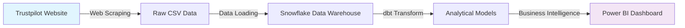

# Trustpilot Analytics Pipeline

**End-to-end analytics engineering pipeline analyzing customer sentiment and review patterns across appliance retailers**

[](https://1drv.ms/b/c/7c19873476ff2ec3/IQDFaUb6vdnKQbFtL3Jh2ZaUAUyMvI-oG49QjotVQVErsBA?e=TFmLhp)
[]()
[]()
[]()

## 📊 Project Overview

This project demonstrates a complete modern data stack implementation, transforming raw web-scraped data into actionable business intelligence. The pipeline extracts customer reviews from Trustpilot's appliance store category, processes them through dbt transformations, and delivers insights via interactive dashboards.

**Business Impact:** Analyzed **4,500+ customer reviews** across **25 appliance companies** to identify customer pain points, sentiment patterns, and response optimization opportunities.

### Key Insights Discovered
- **76% positive sentiment** across appliance industry reviews  
- **Review complexity correlates with lower satisfaction** - reviews mentioning multiple topics average lower ratings
- **Geographic concentration** - 61 countries represented with strong US market presence
- **Response strategy gaps** - companies respond more to positive reviews than negative feedback

## 🏗️ Architecture



## 🛠️ Technology Stack

| Layer | Technology | Purpose |
|-------|------------|---------|
| **Data Extraction** | Python, BeautifulSoup, Requests | Web scraping with robust error handling |
| **Data Warehouse** | Snowflake | Cloud data platform with RBAC |
| **Transformation** | dbt, SQL | Data modeling and business logic |
| **Business Intelligence** | Power BI | Interactive dashboards and analytics |
| **Orchestration** | Manual execution | Development environment |

## 📈 Data Pipeline

**End-to-end transformation process:**
1. **Web Scraping** → Extract reviews and company profiles from Trustpilot
2. **Data Warehousing** → Load into Snowflake with RBAC security  
3. **dbt Transformation** → Clean, deduplicate, and create analytical models
4. **Business Intelligence** → Interactive dashboards with actionable insights

## 📊 Business Intelligence

**[View Dashboard](https://1drv.ms/b/c/7c19873476ff2ec3/IQDFaUb6vdnKQbFtL3Jh2ZaUAUyMvI-oG49QjotVQVErsBA?e=TFmLhp)**

### Dashboard Features
- **Sentiment Analysis:** Distribution and trends across companies
- **Topic Intelligence:** Review complexity vs satisfaction correlation  
- **Geographic Insights:** Customer distribution and market analysis
- **Response Analytics:** Company engagement patterns by sentiment

### Key Metrics
- **4.5K** total reviews analyzed
- **25** appliance companies profiled  
- **61** countries represented
- **8** topic categories detected (delivery, price, service, product, etc.)

## 🚀 Quick Start

### Prerequisites
```bash
python >= 3.8
git
```

### Setup
```bash
# Clone repository
git clone https://github.com/JnrPeter/Trustpilot-Analytics-Pipeline.git
cd Trustpilot-Analytics-Pipeline

# Install dependencies
pip install -r requirements.txt

# Run web scraper
cd scraping
python trustpilot_scraper.py
```

## 🧪 Testing Strategy

- **Schema tests:** Data type validation, not-null constraints
- **Business logic tests:** Rating tiers, sentiment classification  
- **Data quality tests:** Uniqueness, referential integrity
- **Singular tests:** Custom validation for deduplication logic

```bash
# Run all tests
dbt test

# Test specific models
dbt test --select staging
dbt test --select marts
```

## 📚 Documentation

**[Access Data Documentation]** - To explore the complete data lineage, model relationships, and field-level documentation, run `dbt docs generate && dbt docs serve` in the dbt project directory. The interactive documentation provides a comprehensive view of data transformations and business logic implemented in the pipeline.

## 🎯 Business Value

This project demonstrates expertise in modern analytics engineering practices:

- **Analytics Engineering:** Transforming raw data into business-ready models with dbt
- **Data Modeling:** Creating dimensional models and business logic layers
- **Data Quality:** Implementing comprehensive testing and validation  
- **Business Intelligence:** Translating data into actionable insights

**Use Cases:**
- **Customer Experience Teams:** Identify satisfaction drivers and pain points
- **Marketing Teams:** Understand customer sentiment and geographic opportunities  
- **Operations Teams:** Optimize response strategies and service delivery

## 📧 Contact

**Peter Enning Junior**  
Intelligence Engineer | Data Analytics Professional  
📧 p.enning2120@gmail.com  
💼 [LinkedIn](https://www.linkedin.com/in/peter-enning-jnr)

---

*Built with modern data stack best practices • Deployed on Snowflake • Visualized with Power BI*